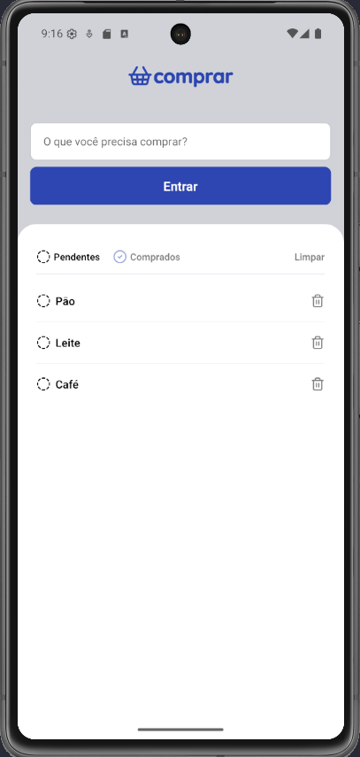

## APP COMPRAR

Neste primeiro módulo, desenvolveremos um aplicativo de lista de compras com React Native e TypeScript, onde os usuários poderão gerenciar seus itens de compra através de funcionalidades como adicionar, remover e marcar itens como comprados. O projeto utiliza tecnologias como AsyncStorage para persistência de dados e explora conceitos essenciais como gerenciamento de estado, componentização, estilização e boas práticas de desenvolvimento, proporcionando uma introdução prática ao desenvolvimento mobile.

 
 
 

  

